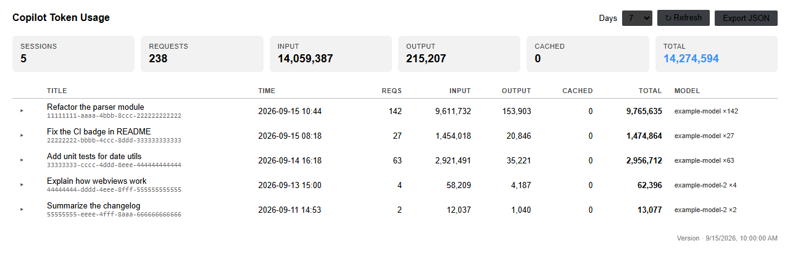

# copilot-tokens

> [English README](README.md)

[](https://github.com/yuyuanjingxuan/copilot-tokens/actions/workflows/ci.yml)
[](https://www.python.org/)
[]()
[](LICENSE)

VS Code Copilot Chat 的 token 用量统计工具（Windows / macOS / Linux）。

解析 VS Code 内置 Copilot Chat 的调试日志（`main.jsonl`），按会话汇总每次 LLM 请求的
输入 / 输出 token、模型、耗时。

**单文件 · 纯 Python 标准库 · 零依赖**

## 为什么需要它

- VS Code 1.13x 起，空窗口（empty window）会话的调试日志写在
  `globalStorage/github.copilot-chat/debug-logs/` 下，而不少第三方统计扩展
  只扫描 `workspaceStorage` 下的旧路径，导致"看不到任何会话"
- 使用 BYOK（自带 API key）的用户在 GitHub 账单页看不到用量，本地统计是唯一途径
- 本工具直接解析日志中的 `llm_request` 事件，不依赖任何 VS Code 内部 API

## 前置条件

在 VS Code 设置中开启调试日志文件记录：

```json
"github.copilot.chat.agentDebugLog.fileLogging.enabled": true
```

> 该设置开启后，每个会话的完整请求日志会写入本地磁盘。
> 如果你不希望日志落盘，可以关闭此设置（本工具将无数据可读）。

## 安装

无需安装，直接运行（需要 Python 3.9+）：

```bash
# Windows：双击 copilot_tokens.bat，或在终端运行
python copilot_tokens.py

# 也可以全局可用
# Windows
copy copilot_tokens.py %USERPROFILE%\scripts\
# macOS / Linux
cp copilot_tokens.py ~/.local/bin/ && chmod +x ~/.local/bin/copilot_tokens
```

## 用法

```
python copilot_tokens.py                # 最近 7 天会话汇总
python copilot_tokens.py --days 30      # 最近 30 天
python copilot_tokens.py --all          # 全部会话
python copilot_tokens.py --top 5        # token 最多的 5 个会话
python copilot_tokens.py --session 6ec414c0   # 单会话逐请求明细（支持前缀匹配）
python copilot_tokens.py --json         # JSON 输出
python copilot_tokens.py --json --out usage.json   # 导出 UTF-8 JSON 文件
python copilot_tokens.py --root /path/to/User      # 非标准 VS Code "User" 目录
```

### 输出示例

```
会话         时间              请求        输入       输出       缓存        总计  模型 / 标题
──────────────────────────────────────────────────────────────────────────────────────────
6ec414c0 09-18 19:07     37      2.9M      60k        0      3.0M  qwen3.8-27b×37  帮我写一个脚本…
a8ba8abd 09-18 18:34      1     9,360      157        0     9,517  qwen3.8-27b  你是谁
──────────────────────────────────────────────────────────────────────────────────────────
合计                         38      2.9M      60k        0      3.0M  2 个会话
```

明细视图（`--session <id>`）：

```
会话 a8ba8abd-…
  版本:   VS Code 1.138.0 / Copilot 0.66.0
  时间:   09-18 17:49 → 09-18 18:34
  标题:   你是谁

  # 时间                耗时        输入      输出      缓存  模型
──────────────────────────────────────────────────────────────
  1 09-18 18:13     5.6s     9,360     157        0  qwen3.8-27b
──────────────────────────────────────────────────────────────
                             9,360     157        0  合计
```

## VS Code 扩展（可选）

一个原生 VS Code 扩展，把同样的解析逻辑包装成跟随主题的 Webview 面板——
汇总卡片、按会话的表格、可展开的每请求明细。自动适配浅色 / 深色主题，
界面支持英文 / 中文（自动检测）。



```
extension/
├── src/
│   ├── extension.ts   # 命令 + Webview 面板
│   ├── parser.ts      # 日志发现与解析（与 CLI 相同逻辑）
│   ├── i18n.ts        # 英文 / 中文字符串
│   └── webview.ts     # 面板 HTML/CSS/JS
├── package.json
└── tsconfig.json
```

### 试用（F5）

1. 用 VS Code 打开 `extension/` 文件夹
2. 运行 `npm install`
3. 按 <kbd>F5</kbd>（Run Extension）——会打开第二个 VS Code 窗口
4. 在该窗口中运行命令 **Copilot Tokens: Show Usage**

### 命令

| 命令 | 作用 |
|---|---|
| `Copilot Tokens: Show Usage` | 打开用量面板 |
| `Copilot Tokens: Refresh` | 重新扫描日志 |
| `Copilot Tokens: Export JSON` | 将当前报告保存为 JSON 文件 |

### 设置

| 设置 | 默认值 | 说明 |
|---|---|---|
| `copilotTokens.days` | `7` | 打开面板时的默认天数窗口 |
| `copilotTokens.language` | `auto` | 界面语言：`auto` / `en` / `zh-CN` |

> 扩展目前是开发版（尚未发布到 Marketplace）。Python CLI 仍是零安装方案，
> 两者解析逻辑完全一致。

## 数据源

脚本自动扫描以下位置（兼容新旧两种布局）：

| 布局 | 路径 |
|---|---|
| 新版（VS Code 1.13x+，含空窗口会话） | `%APPDATA%/Code/User/globalStorage/github.copilot-chat/debug-logs/<sid>/main.jsonl`（Windows）<br>`~/Library/Application Support/Code/User/globalStorage/…`（macOS）<br>`~/.config/Code/User/globalStorage/…`（Linux） |
| 旧版（按工作区） | `%APPDATA%/Code/User/workspaceStorage/<hash>/GitHub.copilot-chat/debug-logs/<sid>/main.jsonl` |

解析的事件类型（`main.jsonl` 为 JSONL，每行一个事件）：

| 事件 | 用途 |
|---|---|
| `llm_request` | `attrs.inputTokens` / `attrs.outputTokens` / `attrs.model` / `attrs.ttft`，顶层 `ts`（epoch ms）/ `dur`（ms） |
| `user_message` | 取首条消息作为会话标题 |
| `session_start` | VS Code / Copilot 版本信息 |

### 已知限制

- **缓存 token 未记录**：VS Code 目前不在日志中写入 cache read/write token
  （见 [microsoft/vscode#329657](https://github.com/microsoft/vscode/issues/329657)）。
  脚本已预留 `cachedTokens` 字段，未来格式支持后会自动生效
- 输入 token 为**每次请求的完整上下文**（含系统提示、历史消息、工具结果），
  因此多轮会话的"输入"总量会远大于实际新增内容——这是上下文累积的正常现象
- 日志格式为 VS Code 内部实现，未公开承诺稳定。若升级 VS Code 后数据缺失，
  请提 issue 并附上 `main.jsonl` 中一条 `llm_request` 事件（**脱敏后**）

## 隐私

- 脚本**只读**本地日志文件，不联网、不上传任何数据
- 会话标题取自你的第一条用户消息，导出 JSON 前请自行检查是否含敏感内容
- 请勿将 `main.jsonl` 原始日志提交到任何仓库

## License

[MIT](LICENSE)
