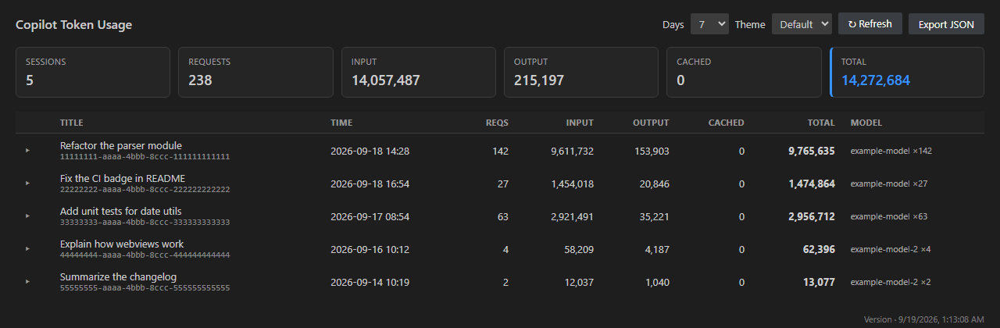
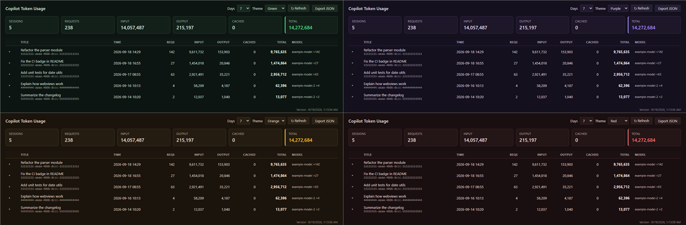

# Copilot Tokens

Token usage tracker for VS Code Copilot Chat (Windows / macOS / Linux).

Parses the built-in Copilot Chat debug logs (`main.jsonl`) and aggregates
input / output tokens, model, and latency **per LLM request** and **per
session** — in a native, theme-aware webview panel.

- **No VS Code internal APIs** — reads the official debug log files only
- **Read-only & private** — never phones home, never uploads anything
- **English / Chinese** UI (auto-detected) + 5 panel color themes
- Works with **BYOK** users (no usage shown on the GitHub billing page)



## Why this exists

- Since VS Code 1.13x, empty-window chat sessions write their debug logs to
  `globalStorage/github.copilot-chat/debug-logs/`, while several third-party
  tracker extensions only scan the older `workspaceStorage` path — so they
  show "no sessions found"
- BYOK (bring-your-own-key) users don't see usage on the GitHub billing page;
  local log analysis is the only option
- This extension parses `llm_request` events directly from the logs

## Prerequisites

Enable debug log file writing in VS Code settings
(`settings.json` or the Settings UI):

```json
"github.copilot.chat.agentDebugLog.fileLogging.enabled": true
```

> With this setting on, full request logs for every session are written to
> local disk. Turn it off if you don't want logs persisted (this extension
> will then have no data to read).

## Features

- **Summary cards** — total sessions, requests, input / output tokens,
  average latency over the selected day window
- **Per-session table** — time, request count, tokens, model, session title
  (from your first user message)
- **Deleted sessions** — sessions you removed from the VS Code chat list
  are still counted (the tokens were consumed) but grouped at the bottom
  with a "Deleted" badge
- **Expandable per-request detail** — duration, TTFT, input / output tokens,
  model for every single LLM request
- **Activity bar icon** — click the icon on the left to open the dashboard
  in the sidebar; `Copilot Tokens: Show Usage` still opens the full-width
  tab panel
- **Status bar** — total tokens for the selected window on the right side
  of the status bar; click to open the panel
- **Auto-refresh** — re-scans the logs every 60 s by default
  (`copilotTokens.autoRefresh`, set `0` to disable)
- **Day window** — 1 / 7 / 30 days or all sessions
- **JSON export** — save the current report as a UTF-8 JSON file
- **Theming** — follows your light/dark theme; 5 accent color themes
  (default / green / purple / orange / red), persisted in settings
- **i18n** — English / 简体中文, auto-detected from the VS Code display
  language



## Commands

| Command | Action |
|---|---|
| `Copilot Tokens: Show Usage` | Open the usage panel (full-width tab) |
| `Copilot Tokens: Refresh` | Re-scan the logs |
| `Copilot Tokens: Export JSON` | Save the current report as a JSON file |

The dashboard is also available as a **sidebar view**: click the
Copilot Tokens icon on the activity bar (left edge). The status bar item
on the right shows the total token count and opens the panel on click.

## Settings

| Setting | Default | Description |
|---|---|---|
| `copilotTokens.days` | `7` | Default day window when opening the panel |
| `copilotTokens.autoRefresh` | `60` | Auto-refresh interval in seconds; `0` disables |
| `copilotTokens.language` | `auto` | UI language: `auto` / `en` / `zh-CN` |
| `copilotTokens.theme` | `default` | Panel color theme: `default` / `green` / `purple` / `orange` / `red` |

## Data sources

The extension auto-discovers logs in both layouts (new and legacy):

| Layout | Path |
|---|---|
| New (VS Code 1.13x+, includes empty-window sessions) | `%APPDATA%/Code/User/globalStorage/github.copilot-chat/debug-logs/<sid>/main.jsonl` (Windows)<br>`~/Library/Application Support/Code/User/globalStorage/…` (macOS)<br>`~/.config/Code/User/globalStorage/…` (Linux) |
| Legacy (per workspace) | `%APPDATA%/Code/User/workspaceStorage/<hash>/GitHub.copilot-chat/debug-logs/<sid>/main.jsonl` |

### Known limitations

- **Cached tokens are not recorded**: VS Code currently does not write cache
  read/write tokens to the log (see
  [microsoft/vscode#329657](https://github.com/microsoft/vscode/issues/329657)).
  The parser reserves a `cachedTokens` field; it will light up automatically
  once the format supports it
- Input tokens are the **full context of each request** (system prompt,
  history, tool results), so multi-turn sessions show a large "input" total —
  this is normal context accumulation, not double counting
- The log format is an internal VS Code implementation with no stability
  guarantee. If data goes missing after a VS Code upgrade, please open an
  issue with one `llm_request` event from your `main.jsonl` (**redacted**)

## Privacy

- The extension is **read-only** over local log files. It never phones home
  or uploads anything
- Session titles come from your first user message — review exported JSON
  for sensitive content before sharing
- Never commit raw `main.jsonl` logs to any repository

## Develop from source

Want the very latest version before it hits the Marketplace?

1. Clone [yuyuanjingxuan/copilot-tokens](https://github.com/yuyuanjingxuan/copilot-tokens)
2. Open the `extension/` folder in VS Code and run `npm install`
3. Press <kbd>F5</kbd> (Run Extension) — a second VS Code window opens with
   the dev build
4. In that window, run **Copilot Tokens: Show Usage**

## License

[MIT](https://github.com/yuyuanjingxuan/copilot-tokens/blob/main/LICENSE)

## Author

[yuyuanjingxuan](https://github.com/yuyuanjingxuan) —
[yuyuanjingxuan/copilot-tokens](https://github.com/yuyuanjingxuan/copilot-tokens)
